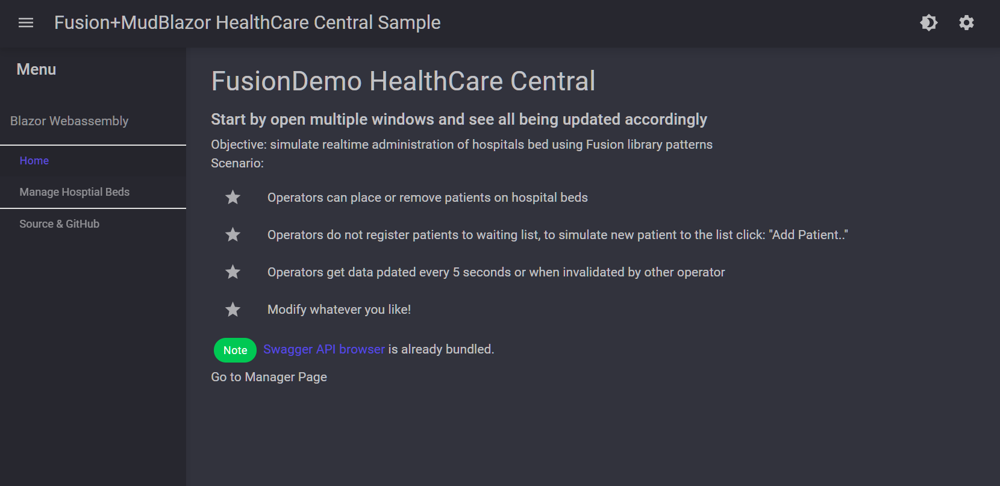
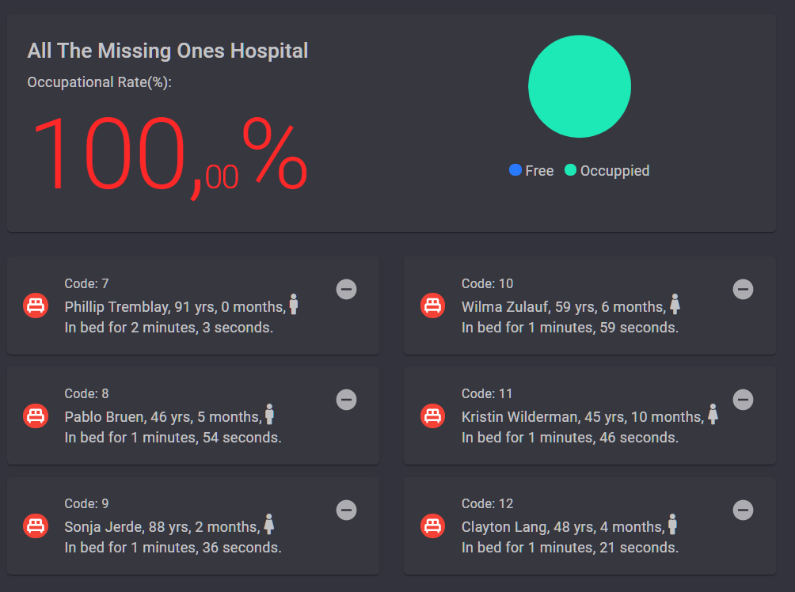

[](https://gitpod.io/#https://github.com/leonibr/healthcaredemo)

### Realtime - HealthCare Central

Start by opening multiple browser windows and see all being updated accordingly

## [Online demo here](https://healthcare.marques.top)

### Quickstart

```bash
git clone https://github.com/leonibr/healthcaredemo
```

```bash
cd healthcaredemo
```

Now there is two options:

- Using docker:

```bash
docker-compose run --service-ports healthcare_demo
# it uses port 5015
```

- Or using dotnet cli:

```bash
 dotnet run --project Host\Host.csproj
# it uses port 5005
# watch out for folder navigation in your OS if not Windows
```

## Or check the screenshots:

1. Home Screen
   
   

1. Place patients by dragging and droping
   

#### Objective:

- simulate realtime administration of hospitals

#### Scenario:

- Operators can place or remove patients on hospital beds
- Operators do not register patients to waiting list, to simulate new patient to the list click: "Add Patient to Waiting List"
- Operators get always updated data whenever is ivalidated by other operator (or other browser window)
- The time is show as duration

#### Constraints:

- Dual mode (WebAssembly and SSB)
- Dragging and Droping without external lib.

#### Modify whatever you like! but please share if you can! 😉

- It was built on top of Fusion's MudBlazor template.

### Changes:

    - updated to .net 7 and Fusion 4.1.38

### Road map:

- Maybe a dashboard

## License

- MIT
